# WorkNex AI - User Manual
**FYP-II | DHA Suffa University**  
**Project:** WorkNex AI - Intelligent Workforce Management System  
**Document Version:** 1.0  
**Last Updated:** 25-Jun-2026

---

## Demo Data Used for Testing

This user manual is prepared using the seeded NovaPay Financial Services demo dataset. The backend contains a complete organization with departments, admin users, managers, employees, attendance records, leave requests, notifications, audit logs, ETL sync logs, performance records, and attrition-risk records. Screenshots were captured after running the seed script and ETL backfill, so the dashboards show successful live data instead of empty tables or failed fetch states.

---

## 1. Login Page

The Login page is the entry point for all WorkNex AI users. A user enters an email address and password, optionally selects the remember-me checkbox, and then clicks **Sign In** to access the system. The page also provides links for password recovery and new organization signup, allowing existing users to regain account access and new users to begin registration without leaving the authentication flow.

---

## 2. Forgot Password Page

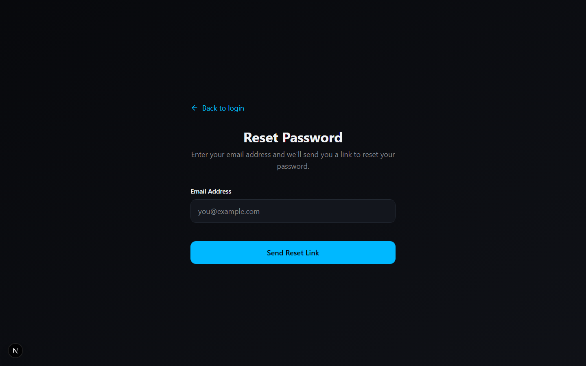

The Forgot Password page is used when a registered user cannot access their account. The user enters their registered email address and submits the form to request a password reset link or reset instruction. The system validates the email, sends the recovery message when the account exists, and guides the user back into the login process after the request is completed.

---

## 3. Reset Password Page

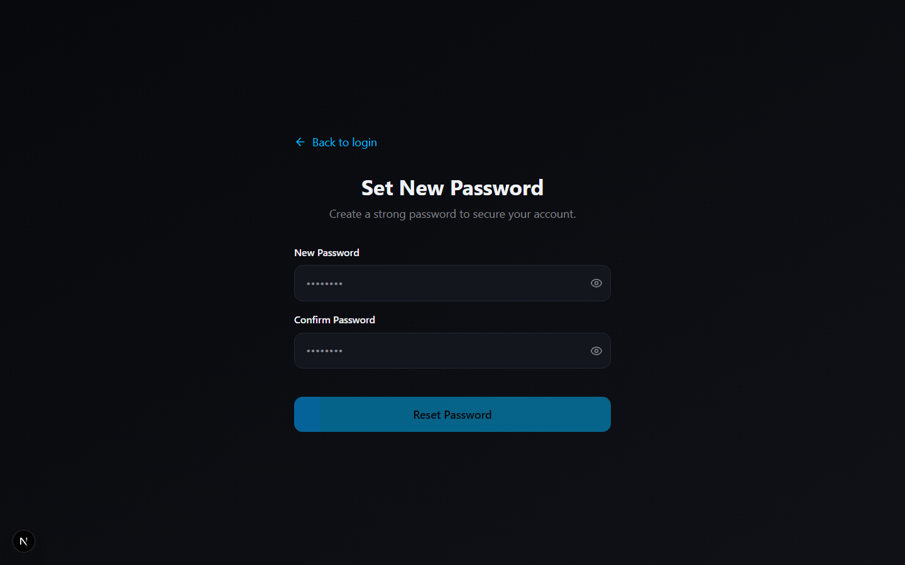

The Reset Password page allows a user to create a new password after opening a valid reset link. The user enters the new password, confirms it, and submits the form so the system can update the account credentials. This screen protects the account by requiring matching password fields and by completing the reset only through the verified reset flow.

---

## 4. Organization Registration Page

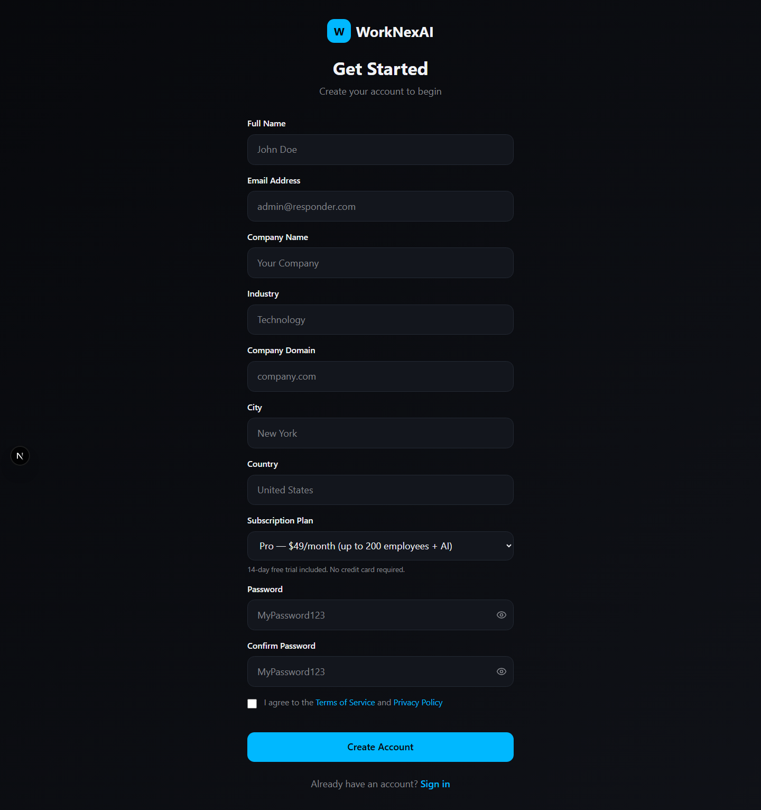

The Organization Registration page creates a new company workspace in WorkNex AI. The administrator enters organization details, personal admin information, login credentials, and business-related information before submitting the form. After successful registration, the system prepares the organization account and continues to email verification so the admin can activate access securely.

---

## 5. OTP Verification Page

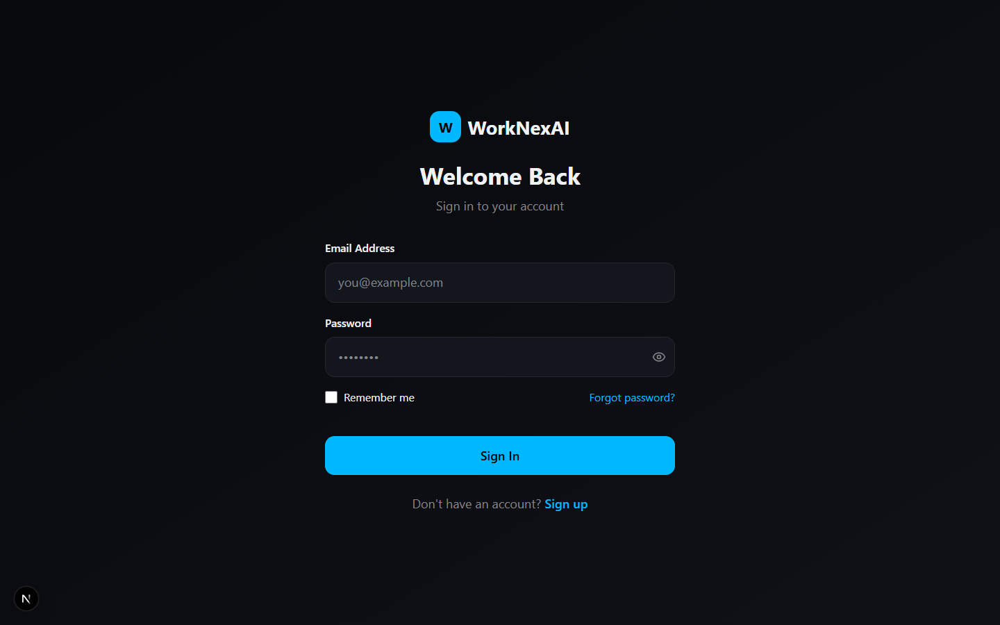

The OTP Verification page confirms that the user owns the email address used during registration or sensitive account actions. The user enters the one-time password received by email and submits it for verification. Once the OTP is accepted, the account or action is verified and the user can continue to the next step in the WorkNex AI workflow.

---

## 6. Admin Dashboard

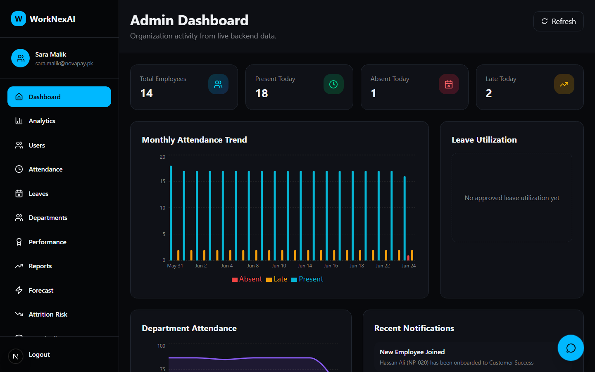

The Admin Dashboard gives administrators a high-level view of organization activity. It summarizes important workforce indicators such as employees, attendance, leave requests, performance, and risk-related metrics in one place. Admin users can use this screen as the main control center for monitoring the organization and quickly navigating to detailed management modules.

---

## 7. User Management

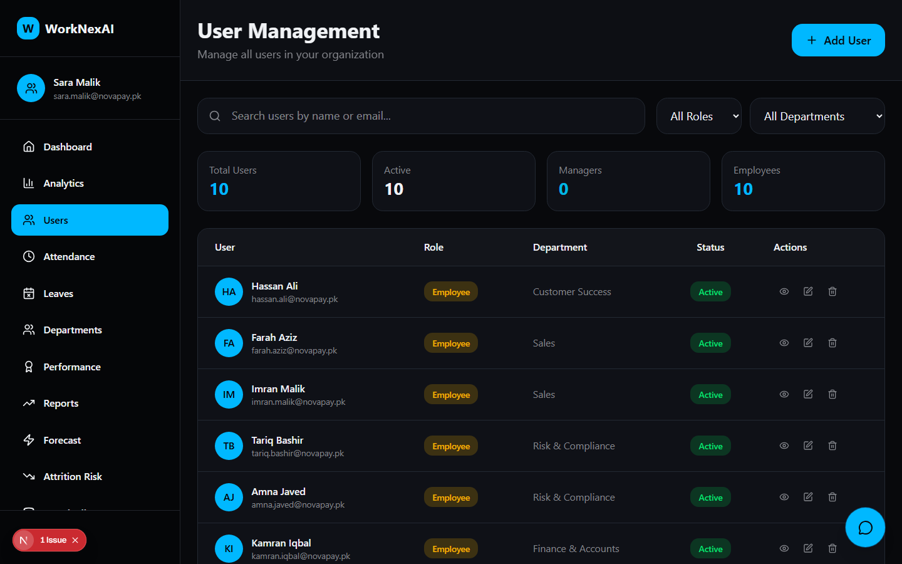

The User Management screen allows administrators to manage employee accounts across the organization. Admins can review user records, add new employees, update profile or role information, search for users, and deactivate accounts when required. This screen keeps the employee directory accurate and ensures that every user has the correct system access.

---

## 8. Department Management

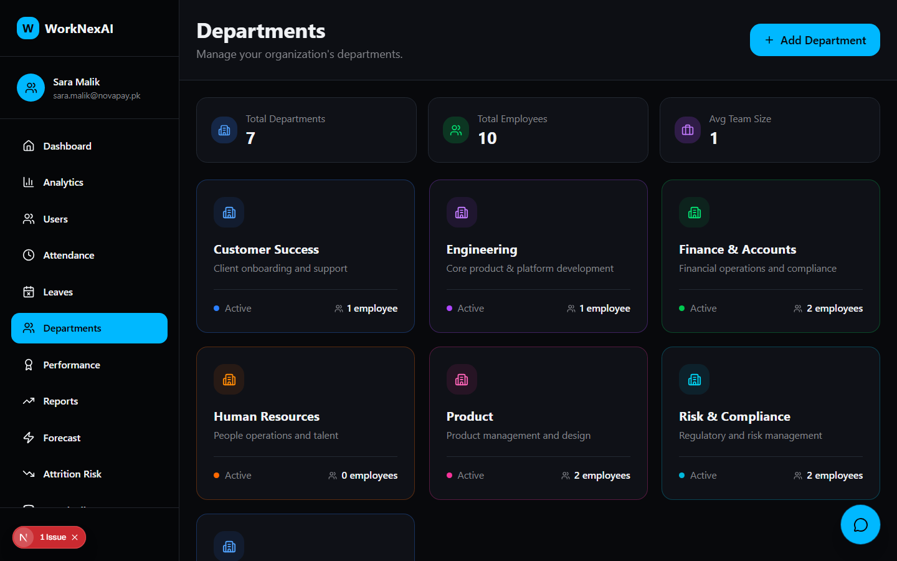

The Department Management screen is used to organize employees into functional business units such as HR, Engineering, Finance, or Operations. Administrators can create and maintain department records, assign employees to the correct department, and keep department-level reporting consistent. This information supports dashboards, analytics, manager views, and filtered reports throughout the system.

---

## 9. Roles and Permissions

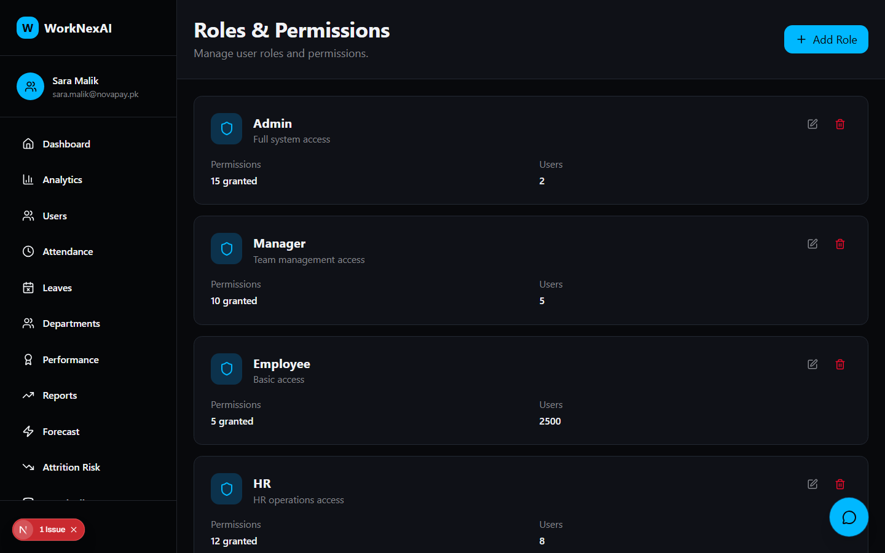

The Roles and Permissions screen controls what each type of user can access inside WorkNex AI. Administrators can review role-based access for Admin, Manager, and Employee users and ensure each role has the correct permissions. This page helps protect sensitive HR information by limiting actions and screens to the appropriate level of authority.

---

## 10. Admin Attendance Management

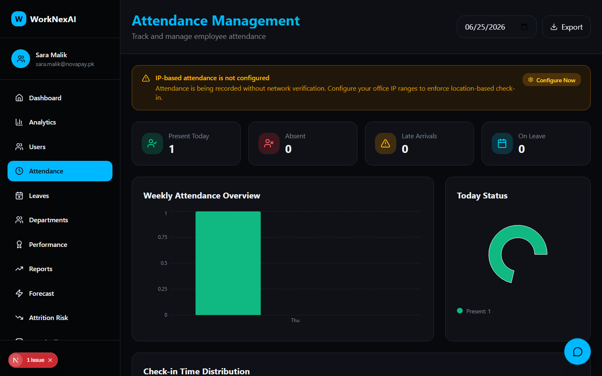

The Admin Attendance Management screen provides an organization-wide view of employee attendance records. Admins can inspect check-in times, check-out times, attendance status, late records, absences, and related attendance details. This screen is useful for verifying daily attendance activity, identifying irregular patterns, and supporting payroll or HR attendance reviews.

---

## 11. Admin Leave Management

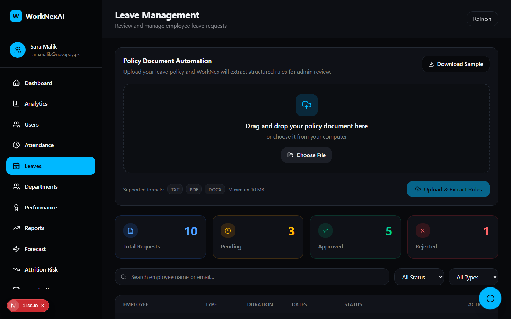

The Admin Leave Management screen lets administrators monitor and process leave requests across the organization. Pending, approved, and rejected requests can be reviewed with employee details, dates, leave type, and reasons. Admins can approve or reject requests where required, and approved leaves update employee leave balances and related reports automatically.

---

## 12. Performance Overview

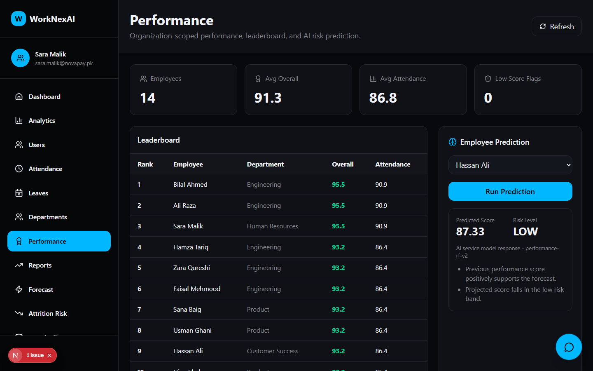

The Performance Overview screen displays employee performance information calculated from attendance, working hours, leave usage, punctuality, and historical performance records. The leaderboard ranks employees by overall score, while the KPI cards summarize employee count, average overall score, average attendance score, and low-score flags. The Employee Prediction panel allows the admin to select an employee and run an AI-backed prediction; the backend gathers that employee's latest attendance rate, previous performance score, department average, average working hours, overtime, late count, absence count, leave count, and half-day count. These features are sent to the AI service when available, and the system returns a predicted score, risk level, model version, confidence signals, and reasons such as stable previous performance or low-risk projected score. If the AI service is unavailable, the backend still produces a deterministic fallback score using the same HR factors so the workflow remains complete.

---

## 13. Analytics Dashboard

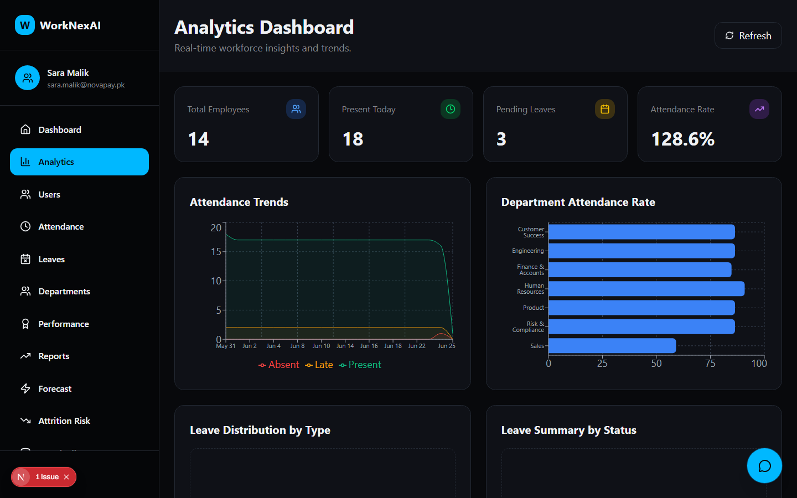

The Analytics Dashboard presents workforce trends and summarized business intelligence for administrators. It combines attendance, leave, performance, and department-level data into visual charts and metrics. Admins can use this page to understand organization health, compare patterns over time, and make informed staffing or HR policy decisions.

---

## 14. Reports

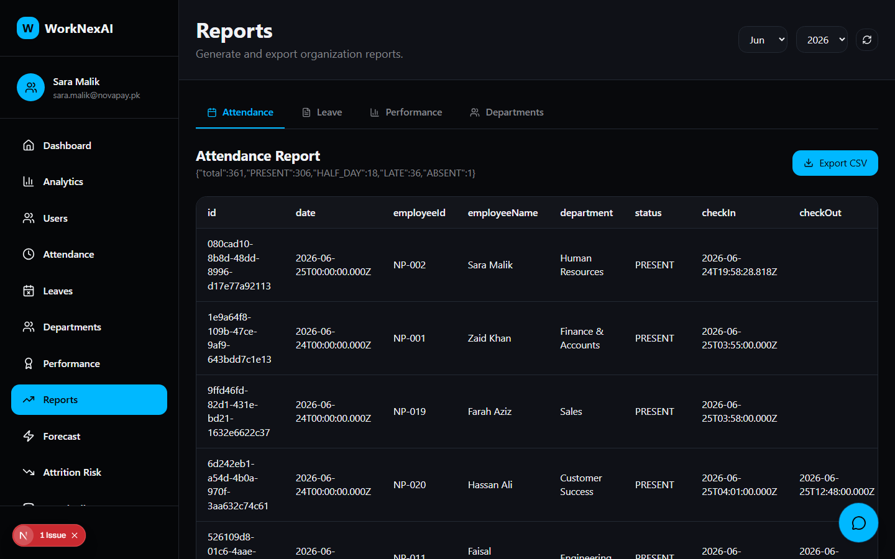

The Reports screen gives administrators access to formal HR reports such as attendance reports, leave summaries, performance reports, department reports, and AI-related reports. Users can generate report views, apply filters where available, and export data for documentation or analysis. This screen supports official record keeping and management review.

---

## 15. AI Forecasts and Predictions

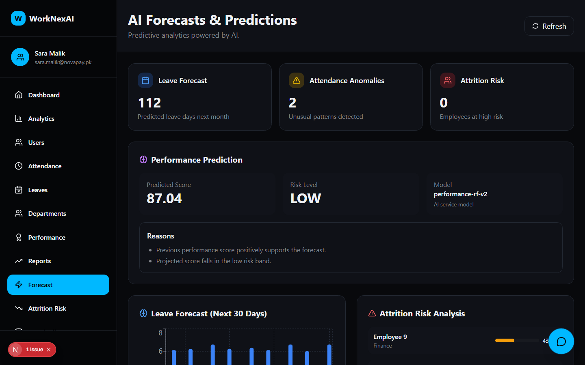

**What It Does:** The AI Forecasts and Predictions screen gives administrators one complete view of predictive HR intelligence. It combines next-month leave demand, unusual attendance patterns, attrition-risk signals, and employee performance prediction into a single dashboard. In the testing screenshot, the system is showing live seeded data: 112 predicted leave days, 2 attendance anomalies, an AI performance score, a low risk level, model information, prediction reasons, and forecast charts.

**How AI Forecasting Is Done:** The backend collects historical leave requests, approved leave dates, attendance records, weekends, holidays, monthly patterns, and employee performance history. These values are converted into prediction features such as attendance rate, late count, absence count, leave count, half-day count, average working hours, previous performance score, department average, and overtime behavior. The AI service then uses these features to estimate future leave volume, detect unusual attendance behavior, identify retention risk, and predict performance. If the external AI service is unavailable, WorkNex still produces a deterministic statistical fallback using the same HR factors, so the screen remains complete for business users.

**Key Features and Benefit:** The Leave Forecast chart helps HR plan staffing for the next 30 days before approving new leave requests. Attendance anomaly detection highlights unusual patterns that may need manager review. Performance prediction shows a predicted score, risk level, model version, and clear reasons, making the output explainable instead of just showing a number. Attrition-risk analysis helps HR identify employees who may need coaching, workload review, or retention support. Together, this page turns raw attendance and leave data into forward-looking planning information.

---

## 16. Attrition Risk

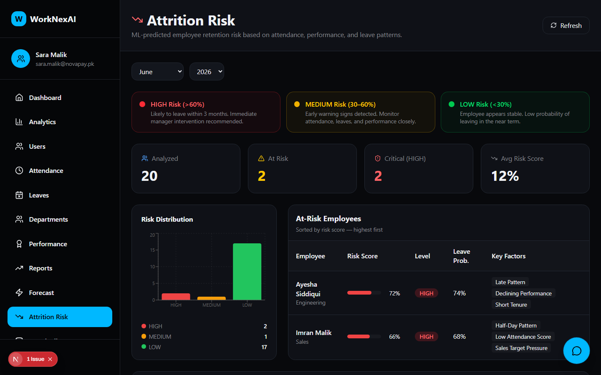

The Attrition Risk screen uses the processed performance records to estimate employee retention risk for the selected month and year. The dashboard shows how many employees were analyzed, how many are at risk, how many are critical/high risk, and the average risk score for the period. The risk table sorts employees by risk score and displays the predicted leave probability plus key factors such as late pattern, declining performance, short tenure, half-day pattern, or low attendance score. Internally, attrition depends on ETL output: attendance and leave records are aggregated into performance records, then the attrition job evaluates warning signals and stores a risk score, risk label, probability, model version, source, and factor list. HR can use this screen to schedule manager check-ins, coaching, workload review, or retention intervention before the issue becomes a resignation.

---

## 17. AI HR Assistant

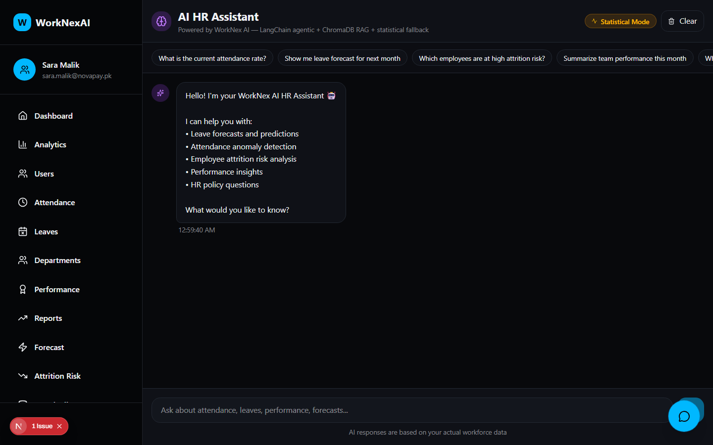

The AI HR Assistant screen provides a chat interface for asking HR-related questions about attendance, leave, performance, forecasting, and workforce status. The admin types a question and the backend forwards the authenticated request to the AI layer, allowing the assistant to answer using permitted WorkNex data instead of unrelated general information. The assistant is intended for operational questions such as today's attendance rate, pending leave requests, top performers, attrition concerns, and team summaries. Because it receives the logged-in user's context, responses can respect role scope and return information relevant to the current organization.

---

## 18. ETL Pipeline

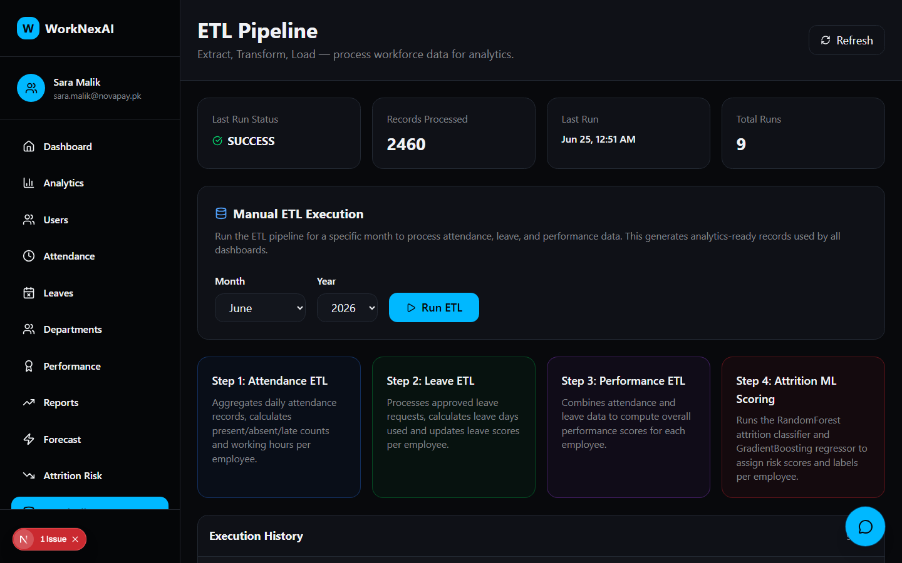

The ETL Pipeline screen controls the data processing flow that prepares raw attendance and leave records for analytics and AI modules. ETL means Extract, Transform, and Load: the system extracts attendance and leave data, transforms it into monthly employee-level metrics, and loads clean records into reporting tables. The pipeline runs jobs in order: Attendance ETL reads check-in/check-out records, Leave ETL syncs leave usage and balances, Performance ETL computes present days, absent days, late days, leave days, average working hours, attendance score, leave score, punctuality score, and overall score, and Attrition ETL uses the resulting performance records to generate retention-risk predictions. This sequence is important because dashboards, reports, performance prediction, attrition risk, and forecast screens all depend on updated ETL output.

---

## 19. Notifications

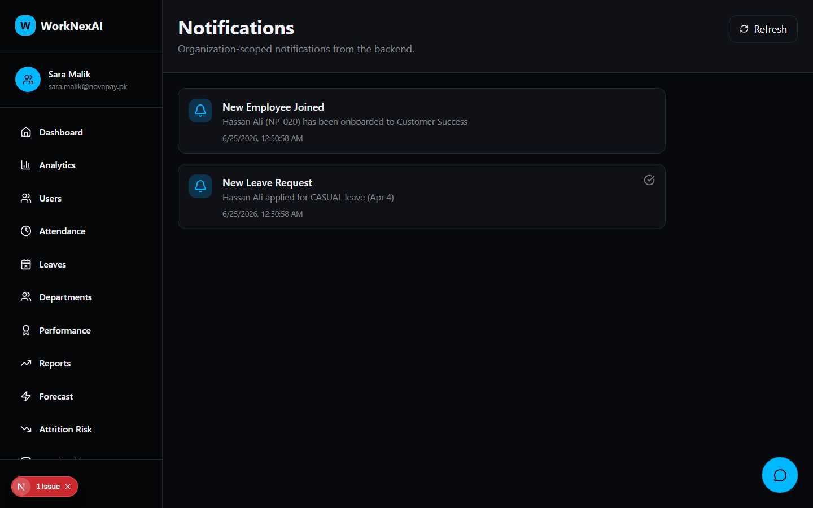

The Notifications screen displays system alerts and user messages related to HR activity. It may include leave request updates, approval messages, reminders, system events, or other important notices. Administrators use this page to stay aware of pending actions and recent system communication.

---

## 20. Audit Logs

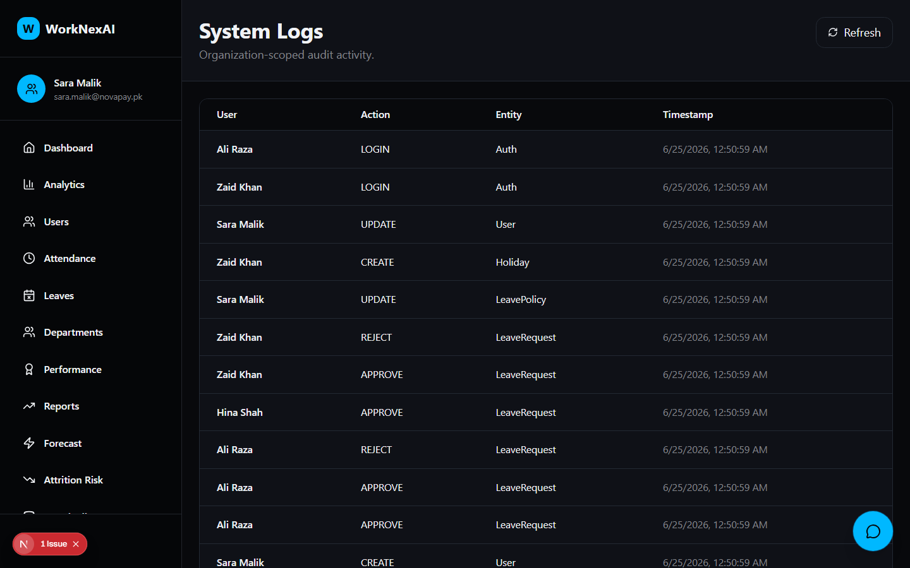

The Audit Logs screen records important actions performed in the system, including logins, approvals, updates, and administrative changes. Each entry helps identify who performed an action, what changed, and when it happened. This screen improves accountability, supports troubleshooting, and provides a traceable history for security and compliance review.

---

## 21. Organization Settings

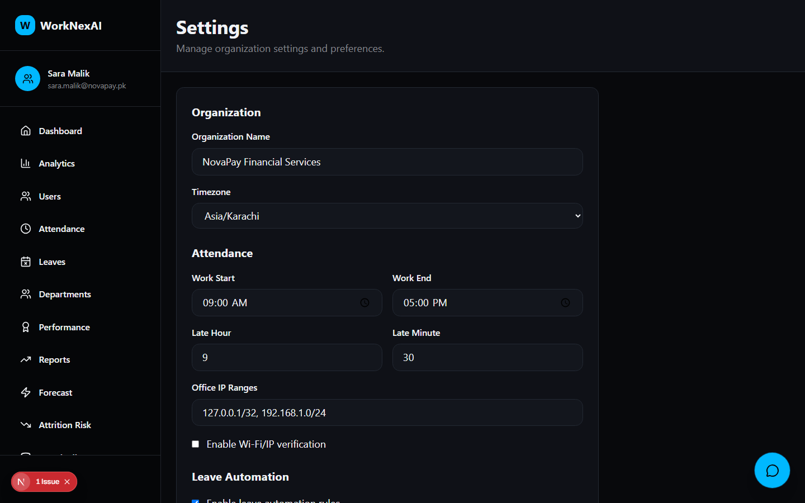

The Organization Settings screen allows administrators to configure organization-wide rules and preferences. Settings may include working hours, attendance rules, late thresholds, Wi-Fi or IP verification, leave policy values, and other business controls. Changes made here affect how the rest of the system calculates attendance, leave balances, and employee status.

---

## 22. Power BI Analytics

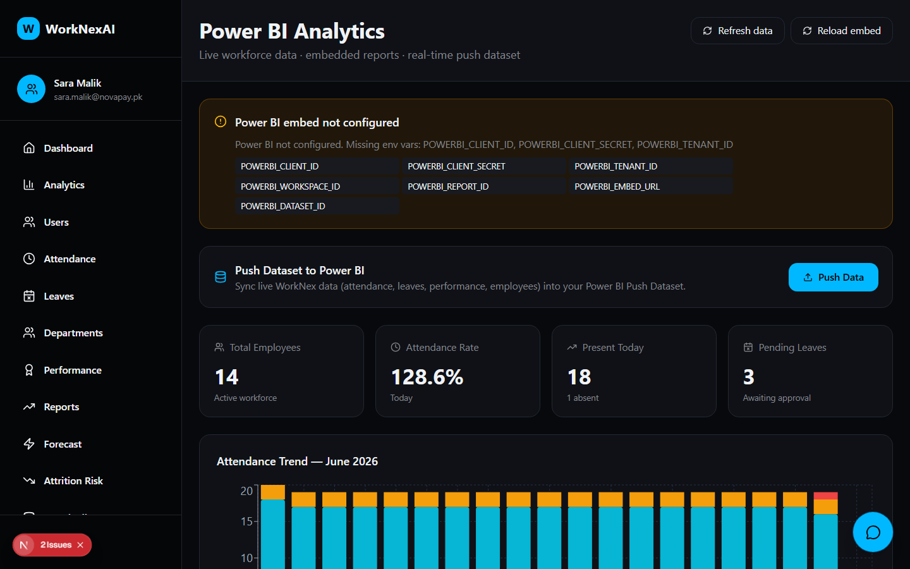

The Power BI Analytics screen is designed to show embedded executive reporting and advanced visual dashboards. Administrators can use this section to review interactive business intelligence views connected to WorkNex AI data. It supports deeper analysis for leadership and provides a reporting area beyond the standard in-app charts.

---

## 23. Manager Dashboard

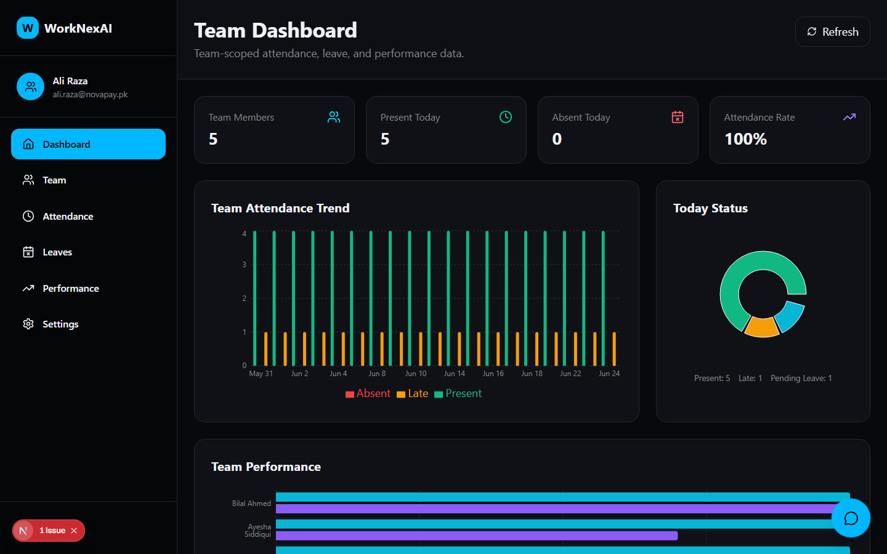

The Manager Dashboard gives managers a team-focused summary instead of organization-wide data. It shows key information about team attendance, pending leaves, performance, and employee activity under that manager. This helps managers monitor their direct team, respond to requests, and identify employees who may need attention.

---

## 24. Team Attendance

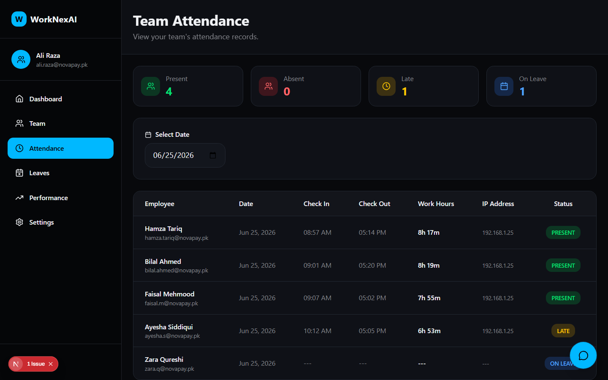

**What It Does:** The Team Attendance screen allows a manager to review daily attendance records for employees directly assigned to their team. The screenshot uses seeded demo data for Ali Raza's engineering team and shows present, late, and on-leave records for June 25, 2026. The top summary cards immediately show how many team members are present, absent, late, or on leave.

**How the Data Is Prepared:** Attendance data comes from check-in/check-out entries, manual corrections, and TMS-synced records. The backend filters results by the logged-in manager's team scope, so a manager only sees employees where they are the assigned manager. Each row is tied to the selected date and includes the employee name, date, check-in time, check-out time, working hours, IP address, and attendance status.

**Key Features and Benefit:** Managers can quickly confirm who is available, who arrived late, and who is on approved leave. This supports daily standups, workload planning, shift coverage, and follow-up with employees who have attendance issues. Because the table uses real attendance records rather than empty placeholders, it also demonstrates that WorkNex role-based access and team filtering are working correctly.

---

## 25. Team Leave Approvals

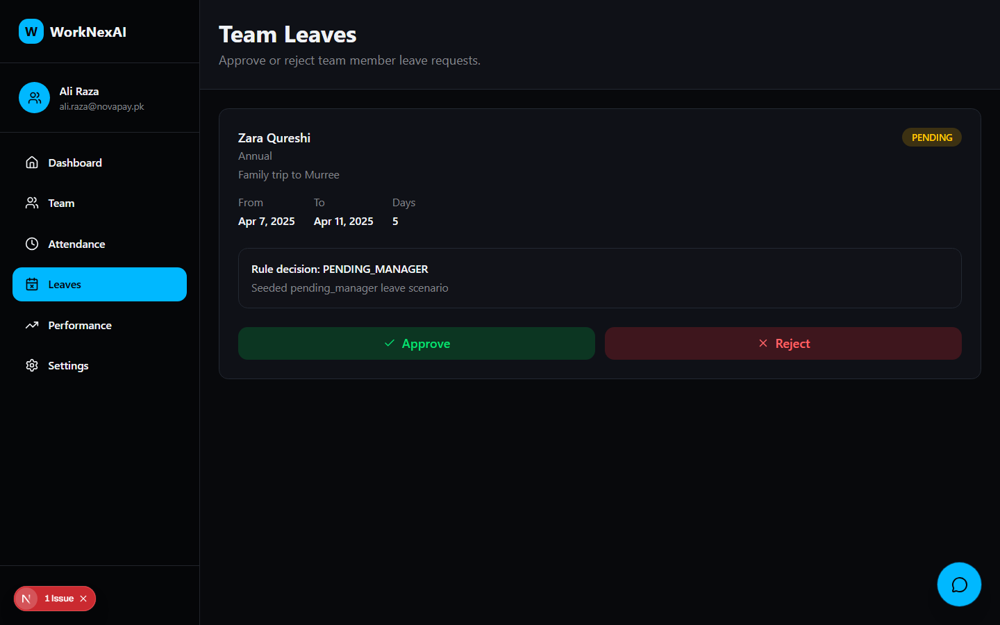

The Team Leave Approvals screen lets managers approve or reject leave requests submitted by their team members. Each request includes the employee name, leave type, date range, reason, and current status. Manager decisions update the request status, notify the employee, and ensure leave balances remain accurate after approval.

---

## 26. Team Management

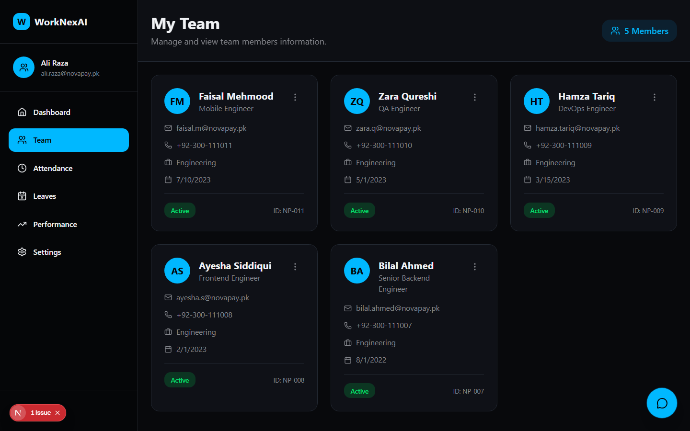

The Team Management screen gives managers a directory-style view of employees reporting to them. It helps managers review team member details, roles, status, and basic profile information. This screen supports quick team lookup and helps managers understand the composition of their department or work group.

---

## 27. Team Performance

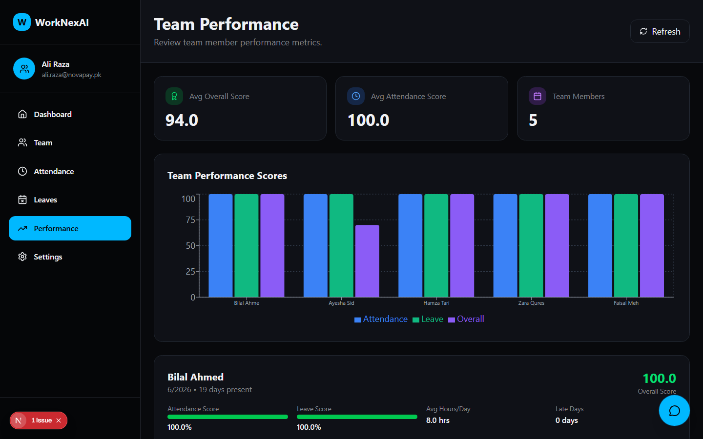

The Team Performance screen shows performance scores and trends for employees managed by the current manager. Managers can compare team members, identify strong contributors, and notice employees whose performance may require coaching. The screen uses processed attendance, leave, and work-hour data to support fair and data-driven team review.

---

## 28. Manager Settings

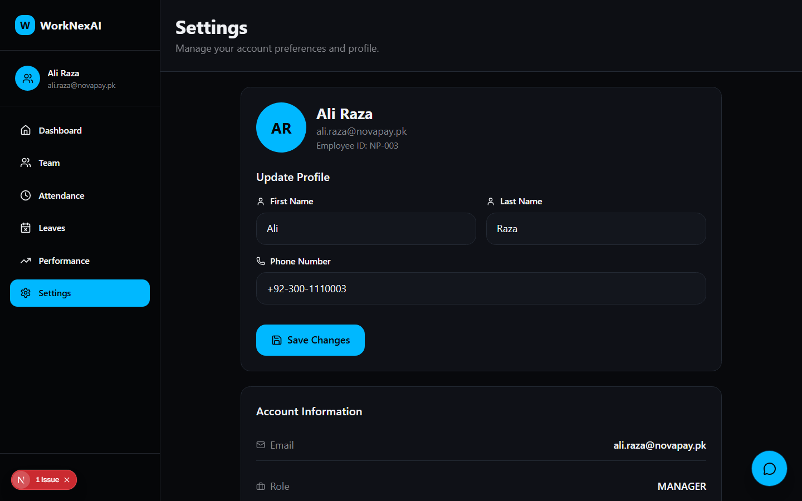

The Manager Settings screen allows managers to review or update personal account preferences related to their role. It may include profile information, account options, notification preferences, or security settings depending on enabled features. This page keeps manager account details separate from organization-wide admin configuration.

---

## 29. Employee Dashboard

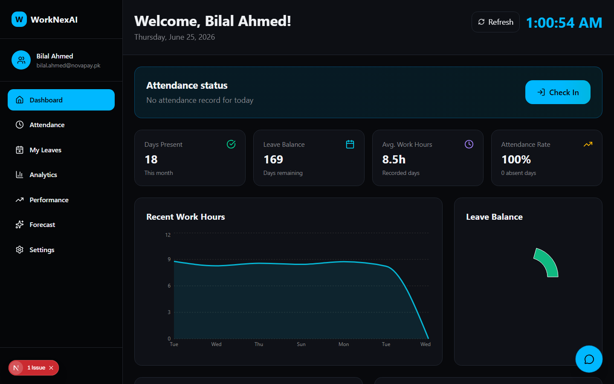

The Employee Dashboard is the personal home page for an employee. It summarizes the employee's own attendance, leave balance, performance score, and recent activity. Employees use this screen to understand their current status and quickly move to daily actions such as attendance check-in, leave application, performance review, or AI assistant support.

---

## 30. Employee Attendance

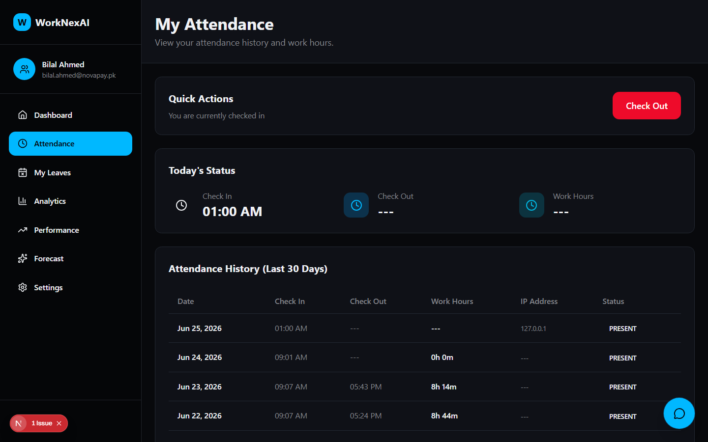

The Employee Attendance screen allows employees to check in, check out, and review their attendance history. The system records time, status, working hours, and verification details such as office network checks when enabled. This screen is the main daily attendance form for employees and directly feeds attendance reports and performance calculations.

---

## 31. Employee Leaves

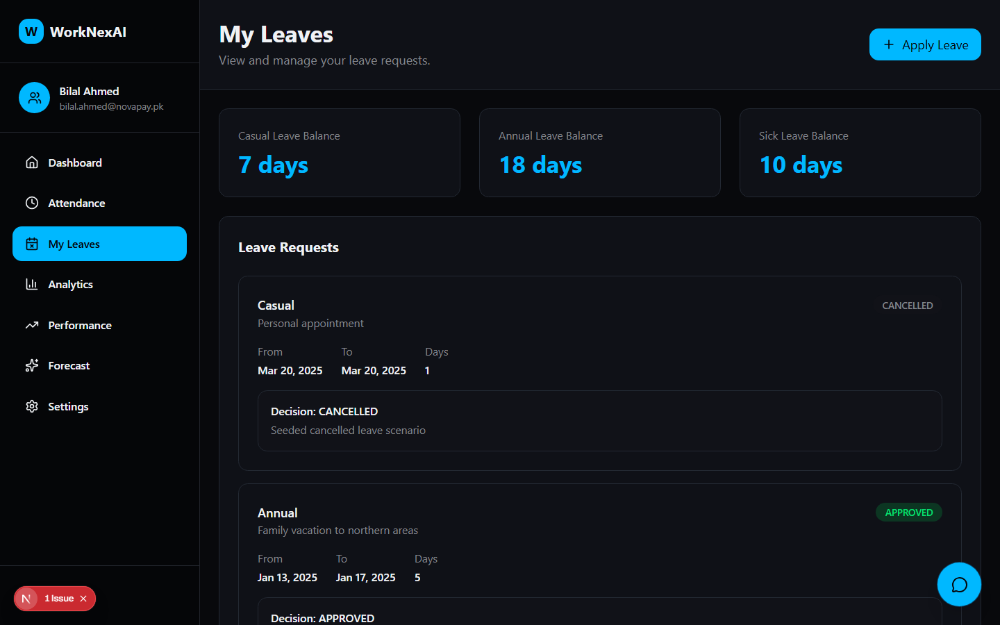

The Employee Leaves screen lets employees apply for leave and track the progress of previous requests. The form captures leave type, date range, and reason, then submits the request to the manager or admin for review. Employees can also see leave balances and request history, helping them plan time off responsibly.

---

## 32. Employee Analytics

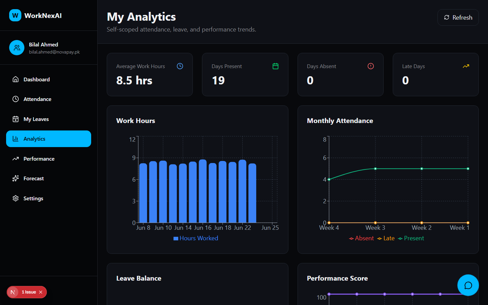

The Employee Analytics screen gives employees a personal view of their attendance and work patterns. Charts and summary values help the employee understand punctuality, work hours, leave usage, and related trends. This page encourages self-monitoring and gives employees visibility into the same data that contributes to reports and AI insights.

---

## 33. Employee Performance

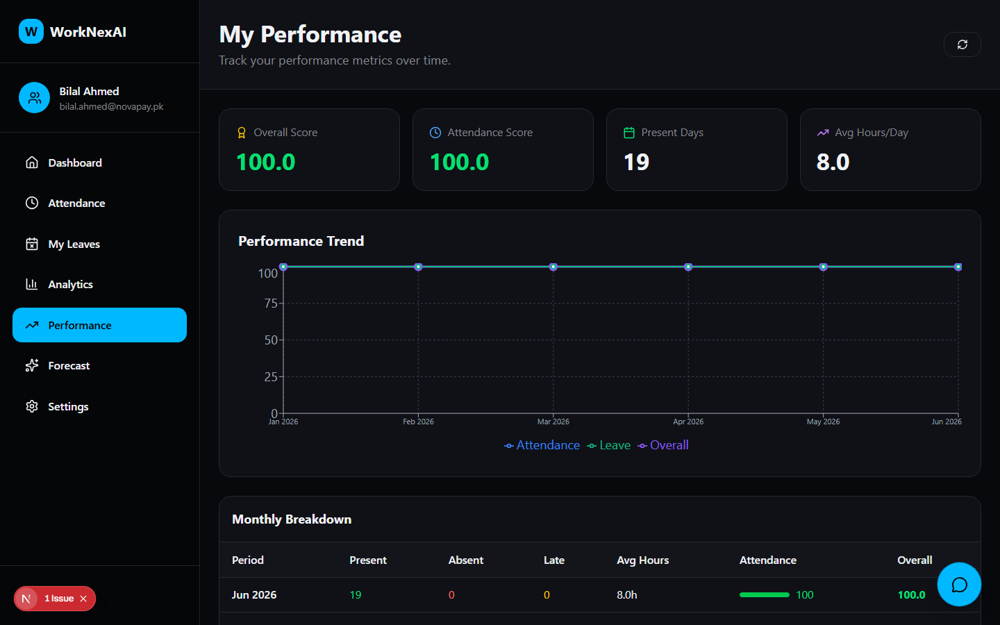

The Employee Performance screen shows the employee's own monthly score, risk level, and performance indicators. It helps employees understand how attendance, working hours, late arrivals, and leaves affect their performance record. The screen supports transparency by showing the employee where they stand and where improvement may be needed.

---

## 34. Employee AI Assistant

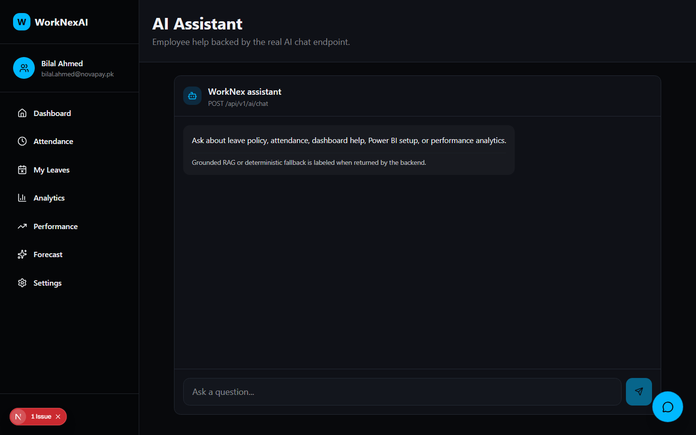

The Employee AI Assistant provides a chat interface for personal HR questions. Employees can ask about their attendance status, leave balance, performance score, or other allowed HR topics. The assistant responds using the employee's own data, helping users get quick answers without navigating multiple pages.

---

## 35. Employee Leave Forecast

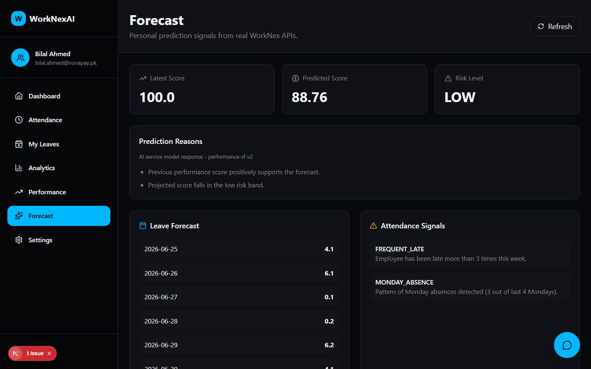

The Employee Leave Forecast screen gives employees a personal forecast view related to upcoming leave planning. It helps the employee understand expected leave demand or relevant forecast information before submitting future requests. This screen supports better planning by showing predictive information in a simple employee-facing format.

---

## 36. Employee Settings

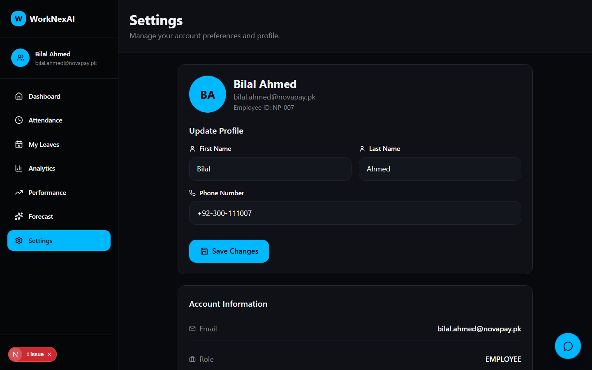

The Employee Settings screen contains personal account and security options for the logged-in employee. Users can review profile details, update preferences, and manage account features such as two-factor authentication where available. This page gives employees control over their own account without exposing admin-only organization settings.

---

## 37. Multi-Agent WorkNex Agent

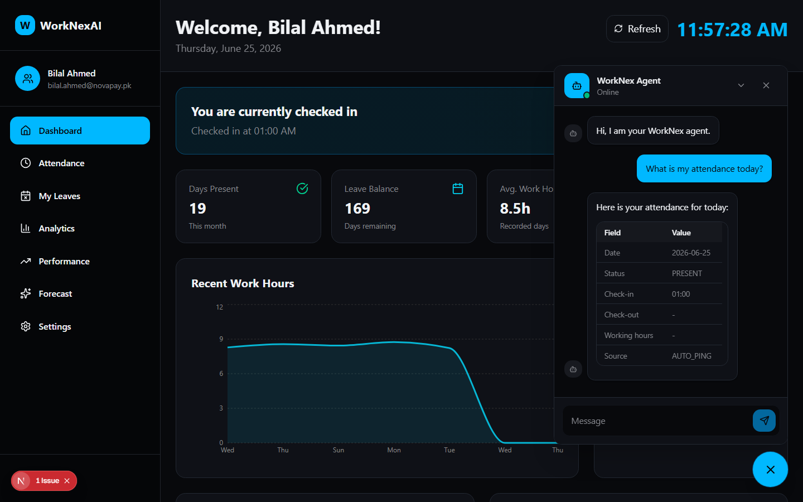

**What It Does:** The Multi-Agent WorkNex Agent is the floating chat assistant available inside the logged-in dashboard experience. It lets users ask operational HR questions directly from the application, such as today's attendance, leave forecast, high attrition risk, or team performance summary.

**How the Multi-Agent System Works:** Unlike a simple chatbot, it runs through a separate multi-agent service with a supervisor agent and specialized read-only sub-agents for attendance, leave, and performance. When the employee asks, "What is my attendance today?", the frontend sends the message, current thread ID, user context, and bearer token to the multi-agent service. The supervisor routes the request to the attendance agent, which calls the WorkNex backend using the same authenticated token, so backend RBAC and organization scoping remain enforced.

**Key Features and Benefit:** The response is returned as a structured table showing the date, status, check-in time, check-out value, working hours, and source. The service also uses Postgres-backed conversation memory, so follow-up questions can continue in the same thread while still respecting the user's role and permissions. This gives the system a stronger impression than a generic chat box because it proves the agent is connected to actual WorkNex data and can answer with role-safe records.

---

*WorkNex AI - Intelligent Workforce Management System*
